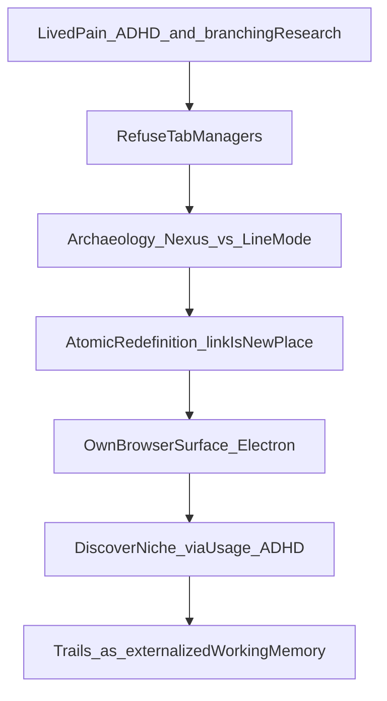
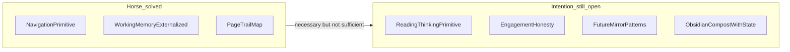
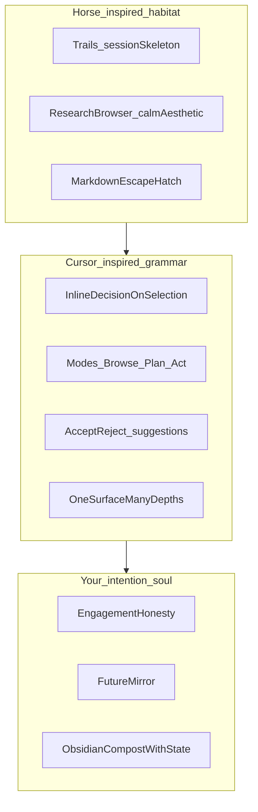

# Inventing Beyond Tool Limits: Horse as Case Study for the Annotation Vision

This is a **vision/invention research note**, not a build brief. It answers: (1) what Horse actually did and how they invented it; (2) where that overlaps your [intention plan](.cursor/plans/pkm_annotation_intention_d283ef1d.plan.md); (3) how to invent the *next* niche once extension/reader/bookmark limits are ignored; (4) how **Horse’s research-browser narrative/aesthetic + Cursor’s flexible UX** fuse into a makeable inspiration spine.

---

## Verdict

Horse solved the **navigation / working-memory** half of your Memex desire by replacing the tab primitive with **Trails®**. Your intention plan still needs a second invention: a **thinking / honesty / self-mirror** layer *on the live page*—something Horse deliberately does not do.

The freshest synthesis: **make a research browser** (Horse’s category, calm narrative, trail habitat) whose *interaction grammar* feels like **Cursor for the live web**—modes, inline acts, plan-before-act, agentic help when wanted, near-zero chrome when not—so browsing becomes a place you *think and do*, not only navigate and save.

Invent like Horse (rewrite the primitive; own the substrate). Feel like Cursor (flexible surfaces for the same mind across different depths of work). Look/sound like Horse’s research calm (not purple-AI chrome; not second-brain dashboard theater).

---

## Part 1 — What Horse makers did (facts)

**Who:** Pascal Pixel (design/engineering) and Eleanor McKeown (community/marketing), Lisbon, indie, no VC. Built for themselves: Pascal’s ADHD browsing; Eleanor’s photo-research work (hundreds of branching archive tabs).

**The atomic redefinition:**

> A link is a new place to stand. Clicking does not overwrite the page you came from.

That single change collapses tabs + history + bookmarks into one vertical, nested, persistent sidebar map called **Trails**. Collapse ≠ close. Restart survives. Drag a Trail out → nested Markdown (Obsidian-ready). Notes can live *inside* Trails. Keyboard-first. Quiet by default (ad block).

**What they explicitly rejected:**

- Another tab manager / vertical tabs / Arc-style groups (“band-aids on a hack”)
- ADHD tools that **restrict** (blockers, shame timers, focus locks)
- “Your brain is broken” framing → “your browser is”

**Historical archaeology (their intellectual move):**

- Berners-Lee’s 1990 **WorldWideWeb/Nexus**: one document, one window (multi-window, non-destructive)
- 1991 **Line Mode Browser**: single window that wipes itself → back/forward → Mosaic → Chrome tab hell
- Tabs (c. 2001) = duct tape on a 1991 terminal compromise
- Horse = Nexus spirit adapted: branching without window sprawl

**Build path (how they stripped tool limits):**

1. Lived pain → refused “manage tabs better”
2. Prototype: React + iframes (idea proof)
3. Reality hit: Wikipedia blocks iframes → must own the browser surface
4. Chose **Electron** (over Tauri) for modern UI + safe external web content
5. ~2 years making Trails work with almost every site (the invisible hard problem)
6. Paid security audit with early revenue
7. Positioned as “research browser” while Trails matured (avoid daily-driver comparison wars)
8. Later: usage data + interviews revealed true niche = **ADHD / externalized executive function** (Daniel Jaeger: “Horse externalizes executive functioning”)
9. Homepage finally said the truth: browser for ADHD minds

Sources: [browser.horse](https://browser.horse/), [about](https://browser.horse/about), [why I built](https://browser.horse/blog/why-i-built-horse-browser), [ADHD creation](https://browser.horse/adhd/adhd-creation-horse-browser), [Pascal’s ADHD positioning essay](https://pascalpixel.com/blog/horse-browser-for-adhd), [manual](https://browser.horse/manual/basics/how-does-horse-browser-work).

---

## Part 2 — Horse vs your intention plan

| Your intention thread | Horse coverage | Gap |
|----------------------|----------------|-----|
| Rabbit-holing as legitimate mode | Core product (“rabbit holes are the point”) | Strong match |
| Trails / smart bracketing | Page-level Trails, collapse, Trailheads, Side-Trails | Match at **navigation** grain; weak at **question/fog/action** grain |
| Park without residue | Collapse, don’t close; survives restart | Match for pages/tasks-as-pages |
| Guilt-free abandon | Delete pages/trails | Exists, but not “honest decay / costume desire” language |
| Markdown → Obsidian | Drag Trail → nested MD | Match for **link maps**; not for annotated spans + voice + state |
| Live web habitat | Full browser, live pages | Match |
| Google Doc on any page | Plain notes *beside* trails, not in-page dialogue | **Major gap** |
| Highlight / margin / threads / todos as micro-decisions | Organic “pages as todos”; no span anchors | **Major gap** |
| Visual rhetoric / stumble / false reading | Not addressed | Open |
| Temperatures hot→dead / incubation | Collapse ≈ warm park of *pages*; no cognitive temperature model | Partial |
| Future mirror (goods + bads) | Externalizes path; does not reflect consume>produce, spark-without-descent, challenge flinch | **Open niche** |
| Hammer / prosthetic | Explicit: tool changes cost of remembering | Match philosophically |
| Not second brain | They still market PKM/vault language; product is closer to **externalized working memory** than mirror | Adjacent, not identical |

**One-line synthesis:** Horse invented the **map of where you went**. Your plan wants the **map of how you thought, fogged, fled, produced, and became**—anchored *in* the page, then composted.

---

## Part 2.5 — Inspiration fusion: Horse × Cursor (what to make from)

You already spend a large share of life in Cursor. Horse’s site/product story is the browser-side twin of that feeling: a calm, niche habitat that respects how you actually work. The invention is not “clone Horse” or “port Cursor to Chrome.” It is **compose their complementary strengths**.

### What to take from Horse (narrative + habitat)

| Steal | Why it fits your intention |
|-------|----------------------------|
| **“Research browser” positioning** | Soft, true category while the hard substrate matures (Pascal’s own strategy before saying ADHD) |
| **Trails as session skeleton** | Rabbit holes leave a map; collapse ≠ close; restart survives |
| **Calm indie aesthetic** | Leafy/quiet, considered type, translucency, little dopamine via rename/emoji—not casino browser chrome |
| **Escape hatch** | Drag Trail → nested Markdown; mind never trapped |
| **Tangents are the point** | Matches your refusal of restriction-as-ADHD-help |
| **One ruthless idea** | Everything serves Trails; resist feature pile-on |

### What to take from Cursor (interaction grammar + doing)

Cursor’s power for you is less “AI chat” and more **UX flexibility around text and action**:

| Cursor pattern | Research-browser translation |
|----------------|------------------------------|
| **Inline act on selection** (Cmd+K energy) | Select span on live page → couple / fog / note / todo / ask—in place, not a separate app |
| **Modes for depth** (Ask / Plan / Agent) | Browse-only quiet mode; Plan/bracket mode before a digression; Agent mode when you want help synthesizing or composting |
| **Plan before mutate** | Mission-control / trail plan you approve before bulk compost to Obsidian or mass re-bracket |
| **Diff / accept energy** | Proposed margin notes, summaries, or zettel seeds as reviewable suggestions—not silent vault spam |
| **Same habitat, many depths** | One research surface: skim, annotate, trail, ask, act—without tool-switching that kills the hot window |
| **Keyboard-first, chrome-last** | Matches your screen-real-estate moral constraint |
| **Context-aware help** | Help that sees the page + your trail + open loops—not a generic chatbot pane that steals coupling |

### The fusion product family (name the shape, not the stack)

**One-line product hypothesis:**

> A research browser where Trails hold the rabbit hole, Cursor-like modes let you think and do on the live page, and honest traces compost into Obsidian—and eventually mirror how you actually learn.

### Steal vs refuse (discipline)

**Steal**

1. Horse’s category story: research browser, not “another productivity suite”
2. Horse’s visual calm and trail-first layout intuition
3. Cursor’s mode switching without leaving the habitat
4. Cursor’s selection → act as the primary verb
5. Cursor’s plan/review gates before consequential writes (especially vault compost)

**Refuse**

1. Cloning Horse’s exact UI/colors (inspiration ≠ cosplay; find your own calm)
2. Turning the page into an IDE (code metaphors that break reading coupling)
3. Always-on agent chatter (your intention: coupling vs solitude tension)
4. Second-brain dashboard theater / streak moralizing
5. Feature fusion soup: Arc + Hypothesis + Readwise + Cursor chat bolted together

### Why this is “something to make” (not just admire)

- Horse proves people will **pay for a niche browser** when one primitive is rewritten and the narrative is honest.
- Cursor proves you personally will **live inside a tool** when UX flex matches the grain of your work (text, generation, doing).
- Your intention plan needs both: **habitat for curiosity** (Horse) + **grammar for micro-production and depth** (Cursor) + **mirror/honesty** (yours).

This remains vision-level. The substrate question (own browser vs deep shell vs hybrid) stays open until the atomic sentence is sharp—but the *inspiration spine* is now concrete enough to design against.

---

## Part 3 — How to invent a novel niche (Horse’s method, applied to your vision)

Strip away “extension vs reader vs bookmark vs Arc.” Invent like Horse:

### Step A — Name the wrong inherited primitive

Horse’s wrong primitive: **destructive navigation** (one slot overwritten; tabs as coping).

Your wrong primitives (from the intention plan):

1. **Reading = extracting strings** (clippers flatten visual rhetoric and spatial memory)
2. **Capture = saving URLs/highlights** (mausoleums without *why* / heat / honesty)
3. **Knowledge tool = second brain store** (hoard over recognition)
4. **ADHD/productivity fix = restrict curiosity** (Horse already rejected this; keep rejecting it)

The novel move is not “better Hypothes.is + better Readwise + Horse Trails.” It is redefining the atomic act of learning on the web.

### Step B — One atomic redefinition (candidate)

Horse: *link → new place to stand.*

Candidate for your vision:

> **A selection on a live page is a decision site** — not a clip. The cheap acts are: couple (respond), mark fog, park-with-why, micro-produce, or honest release. Scroll alone never counts as knowing. Trails of *pages* and trails of *thought* share one associative substrate. Over time the system mirrors patterns (consume/produce, spark-without-descent, challenge exits) without prosecuting them.

That is the “Google Doc on any page + mission control + Obsidian compost + future mirror” claim, compressed into one primitive.

### Step C — Own the substrate that makes the primitive true

Horse could not ship Trails as an extension of Chrome’s tab model; they had to own navigation.

Your primitive likely cannot ship as:

- pure annotation extension (no trail/session ecology, weak persistence of intent)
- pure reader (kills live habitat)
- pure Horse-like browser (has trails, lacks in-page thinking grammar)
- pure Obsidian plugin (too late; after the hot window)

**Implication if limits are stripped:** the product family is a **research browser** (Horse category) with **Cursor-like interaction grammar** where:

- Trails-like branching is the *session skeleton*
- Inline selection→act (Cursor Cmd+K energy) is the *coupling tissue*
- Modes (browse / plan-bracket / act-agent) are the *depth dial*
- Temperatures / brackets are the *incubation layer*
- Dashboard is *reactivation + honesty*, not unread guilt
- Reviewable suggestions before vault writes (Cursor plan/diff energy)
- Obsidian export preserves anchor + voice + state + trail + tags
- Mirror learns goods/bads from traces, not from streak theater
- Aesthetic: research calm (Horse-inspired), not IDE chrome or purple-AI default

### Step D — Niche discovery (do what Pascal did late, earlier)

Horse thought “research browser for everyone”; data said “ADHD externalized EF.”

For your vision, the likely niche is narrower than “PKM users”:

- People whose failure mode is **spark without descent** + **consume > produce** + **intent mausoleums**
- Who already want rabbit holes *and* Zettelkasten compost
- Who reject both second-brain hoarding and productivity shame

Positioning lesson from Pascal: strategic soft label while the hard substrate matures; then say the true niche when usage proves it. **Default soft label for this fusion: research browser**—not “AI reading coach,” not “second brain.” Cursor’s lesson: earn daily residence through UX flexibility, then deepen the soul (mirror) once traces exist.

### Step E — What “novel / nuance / niche” looks like (vision sketch, not features)

Not a feature list—**differentiation axes** where Horse stops and you begin:

1. **Grain:** page-branch map → span-level decision sites on live visual rhetoric
2. **Verb:** remember path → decide / fog / park / produce / release
3. **Truth:** “you were here” → “you actually coupled vs performed reading”
4. **Time:** persistent sidebar → hot/warm/cool/dead + incubation vs mausoleum
5. **Self:** calm external memory → future mirror of wanting and follow-through
6. **Exit:** markdown link outline → compost with state into Obsidian identity-layer notes

### Step F — Productive non-goals (steal Horse’s discipline)

Horse’s power is one idea served ruthlessly. For a novel solution:

- Do not become “Arc + Hypothesis + Readwise + Reflect + Coach”
- Do not moralize production into homework energy
- Do not surveil engagement into a grade
- Do not force taxonomy at capture
- Do allow decay and costume-desire honesty

---

## Part 4 — Invention checklist (reusable)

When inventing beyond current tools:

1. **Lived contradiction** — where does the habitat punish the real cognitive style?
2. **Refuse the category** — name the patch everyone sells; discard it
3. **Archaeology** — what 1990s/2000s compromise are we still coping with?
4. **One sentence primitive** — if this one act changes, the rest follows
5. **Substrate honesty** — what must you own that extensions cannot?
6. **Invisible hard problem** — Horse: every site with Trails; yours: huge live pages + honest engagement without jank or shame
7. **Escape hatch** — plain text / Markdown out; never trap the mind
8. **Niche from behavior** — interview heavy users; update the homepage when the truth is clear
9. **Indie constraint as virtue** — answer to the thinking style, not ad networks

---

## What this research does *not* claim

- That you should fork Horse or build a browser tomorrow
- That Horse is incomplete as *their* product (they solved their atomic problem)
- That annotation extensions are useless (they are the wrong *primitive*, not useless tools)

It claims: **Horse is the closest living proof of your Memex/trail instinct at the navigation layer; Cursor is the closest daily proof that flexible thinking/doing UX can become a habitat; the open niche is fusing those into a research browser with a thinking-and-mirror layer on the live web.**

---

## Suggested next probes (still idea-level)

- Walk one real session in Horse (or Tree-Style Tabs as pale shadow) and note what still dies: fog, false reading, no micro-produce, no why-on-open
- Write your atomic sentence until it is as sharp as “a link is a new place to stand”
- Abandoned-tab autopsy ×3 with temperatures + whether a Trail would have saved the *page* but not the *intent*
- Decide whether “future mirror” is the product soul or a later consequence of honest traces (Horse discovered ADHD after shipping Trails)
- **Horse × Cursor naming:** one line for the product family; list 5 flexibilities to steal from Cursor and 5 to refuse
- **Aesthetic spine:** screenshot/note Horse site cues you love (color, calm, type)—constraints for a distinct research-browser look, not a clone
- **Cursor day autopsy:** which Cursor surfaces do you actually live in (inline / chat / plan / agent), and which map 1:1 onto reading vs composting vs acting?
