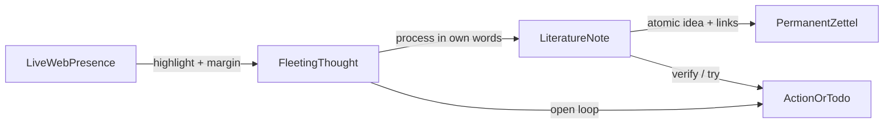
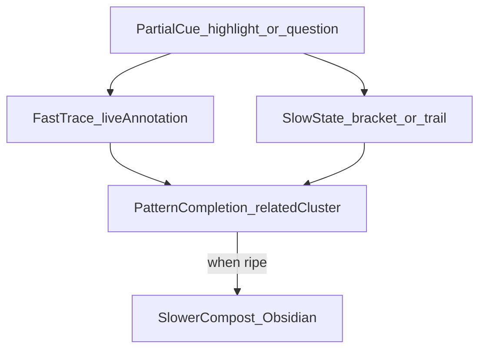
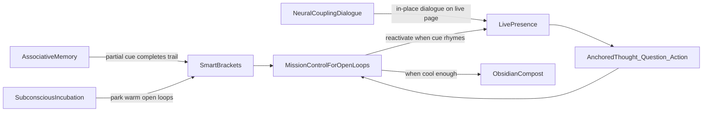
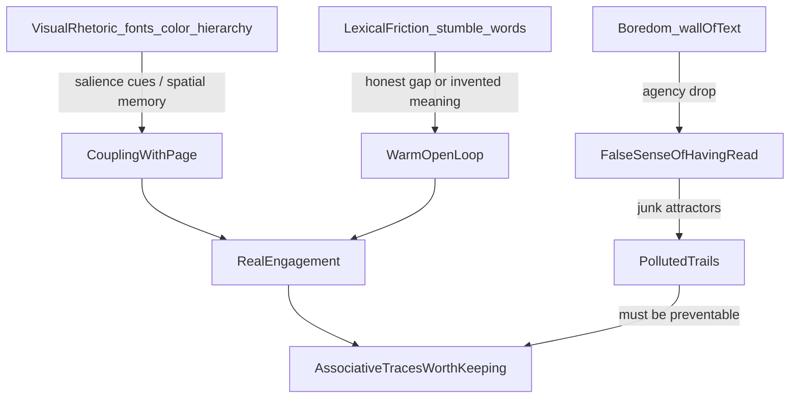
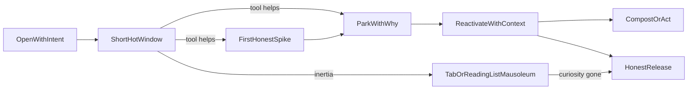
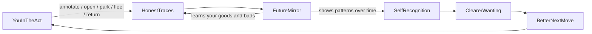
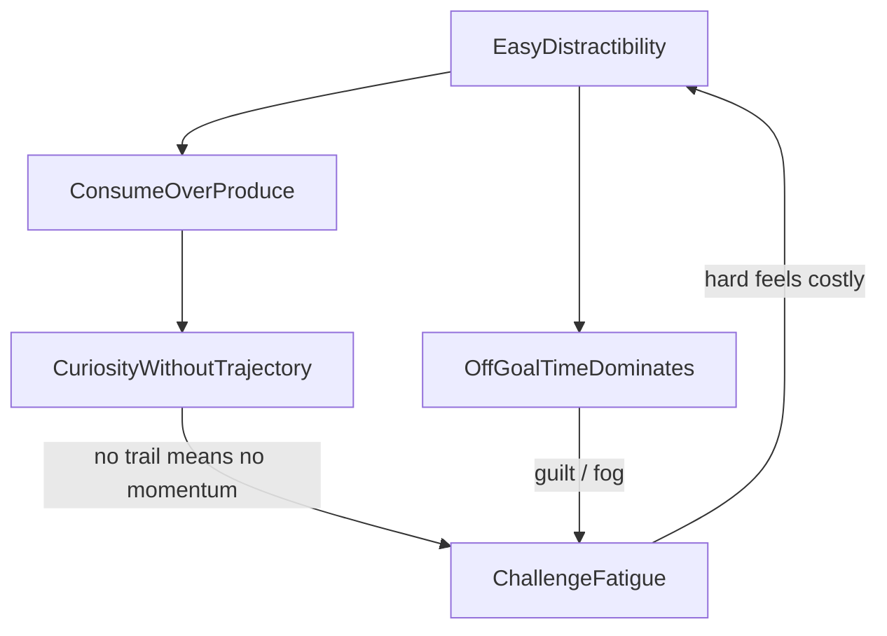

# Exploring the Intention: Action-Driven Web Annotation as Learning Practice

This is an idea exploration, not a solution brief. The goal is to understand what you are actually reaching for when you describe “Google Doc on any live page + smart dashboard + Obsidian,” and why that desire keeps failing against existing tool categories.

---

## 1. What you are really asking for

On the surface: highlight, margin notes, comment threads, dashboard, Obsidian export.

Underneath: you want **browsing to become a thinking medium**, not a consumption medium.

Most tools optimize one of these:

| Mode | What it optimizes | What it sacrifices |
|------|-------------------|--------------------|
| Bookmark / later | Capture & retrieval | Thinking-in-place |
| Reader-view highlight | Clean reading | Live context, rabbit-hole continuity |
| Social annotation | Shared discourse | Personal actionability, modern UX |
| Vault-first clip | Obsidian hygiene | Presence on the live page |

Your criteria reject all four because the real job is different:

> Stay inside the live web’s energy (curiosity, surprise, digression), while continuously converting that energy into **owned thought, open questions, and next actions**—without breaking flow, and without losing the trail when topics fork.

That is closer to Bush’s Memex than to “read-it-later.” The Memex was not a library; it was an **intimate supplement to memory** where the essential act was *tying items together into trails*. You are asking for a personal trail-blazing layer over the modern web.

---

## 2. The “Google Doc on any webpage” metaphor — and its hidden claim

Calling a webpage a Google Doc is not about UI chrome. It claims three things:

1. **The page is writable.** The author’s text is not sacred; it is a substrate for your dialogue.
2. **Thinking is anchored in place.** A comment belongs *to a span*, not to a floating notebook.
3. **Conversation can continue.** Threads imply unfinished cognitive work: questions, disagreements, “come back to this.”

Research on annotation as metacognition supports this: highlighting alone is weak; **evaluation + translation into your own words** is what produces learning. Margin notes are where annotation becomes processing. Recent work on “AI margin notes” reinforces a related design truth: people prefer **integrated, manually selected, in-place notes** over a separate chat pane—because ownership and locality matter more than raw speed.

So the metaphor is really: *I refuse to leave the scene of insight to go “take notes elsewhere.”*

That refusal is the product requirement in disguise.

---

## 3. Rabbit-holing as a legitimate knowledge mode

You named the practice: rabbit-hole deepdiving. That is usually framed as a vice (distraction). You are reframing it as a **learning style**—associative, multi-topic, curiosity-led.

Bush’s insight still applies: the mind works by association, not by hierarchical filing. Trails fade if not followed; items are not fully permanent. A tool that punishes digression (by forcing premature filing, folders, or “finish this article first”) fights how you actually learn.

But digression without capture produces **attention residue** (Leroy): unfinished cognitive threads linger and degrade the next focus. So the real design tension is not “focus vs rabbit-hole.” It is:

> How do I **park a trail cleanly** so I can fork into another, then resume without residue—and without killing the fun of the digression?

Your “smart and intuitive bracketing” is exactly this: cognitive closure rituals for unfinished curiosity, not just folders.

Bracketing, in this sense, might mean:

- **Session brackets** — “this afternoon’s digression cluster”
- **Question brackets** — open questions that own a set of pages
- **Tension brackets** — contradictions / competing claims across sources
- **Action brackets** — todos that emerged from reading, not from a task app
- **Trail brackets** — Memex-style chains: A led to B led to C, even if topics look unrelated on a taxonomy

The dashboard you want is less “library of clipped docs” and more **mission control for open cognitive loops**.

---

## 4. Action-driven learning: the missing verb

Most PKM tools are strong at *collect* and *store*. You keep stressing *actionable* and *todos*. That suggests a third verb is central:

**Decide.**

While reading, you are not only understanding; you are constantly making micro-decisions:

- Is this true / useful / worth keeping?
- What does this imply I should try, verify, or write?
- What question did this open that I cannot answer yet?
- Which other open loop does this connect to?

Highlight = “this mattered.”  
Margin note = “here is my thought.”  
Comment thread = “this is unresolved.”  
Todo = “this demands a next move.”

The fun you mention is not gamification. It is the pleasure of **agency**: turning a passive scroll into a series of small, consequential moves. Learning sticks better when it feels like play because play is high-agency exploration with low shame for wrong turns.

A tool that only archives highlights removes the game. A tool that only creates tasks removes the wonder. You want both in the same gesture space.

---

## 5. The three layers of knowledge you are juggling

Your Obsidian + OKF + Zettelkasten setup implies a lifecycle. Web annotation sits awkwardly across all three layers:

Critical tension: **Ahrens-style Zettelkasten distrusts highlighting** and wants notes in your own words, processed soon. Live-web annotation loves highlighting and in-situ comments. Those are not enemies if you treat the web layer as a **high-fidelity fleeting + literature capture surface**, and Obsidian as the **composting / permanent layer**.

Frictionless export is not “dump highlights into a note.” It is preserving:

- the *anchor* (what on the page sparked this)
- the *voice* (your comment, not just the quote)
- the *state* (open question vs settled insight vs todo)
- the *trail* (what you were pursuing when this appeared)
- the *tags* that make OKF / Zettelkasten routing work

Without those, export becomes another inbox of dead clips.

---

## 6. Why “live page” matters more than you might think

Reader-view tools (Wallabag-class) fail you not only because of UX taste, but because they **sever the ecology of the page**:

- sidebars, docs nav, interactive demos, code samples, comments, related links
- the spatial memory of “it was halfway down, next to that diagram”
- the ability to keep clicking outward without changing medium

Rabbit-holing is ecological. The live page is a habitat. Annotation that only works after capture into a sanitized reader is annotation of a specimen, not of the living animal.

That also explains the performance criterion: if the layer makes huge pages janky, it destroys the habitat. Performance is not a tech preference; it is **trust that the thinking medium will not punish curiosity**.

---

## 7. Screen real estate as a moral constraint

You called out limited screen real estate, gestures, shortcuts. That is not polish; it is respect for a scarce resource: **attention width**.

On a live page, every chrome pixel competes with the author’s argument and your emerging thought. A modern Memex/Readwise-like aesthetic matters because dated or heavy UI constantly reminds you that you are “using a tool,” which breaks the illusion that the page itself became writable.

Ideal interaction grammar (conceptually):

- Near-zero idle chrome
- Instant select → act (highlight / note / ask / todo)
- Margin presence that feels like a whisper, not a panel invasion
- Keyboard/gesture as primary; mouse as secondary
- Dashboard as a *return surface*, not a constant companion

The Google Doc feeling is partly: the UI disappears into the document.

---

## 8. Multi-topic simultaneity: the real dashboard problem

You work on multiple unrelated topics at once. Classic PKM answers with folders, tags, or projects. Those assume you already know the ontology.

Rabbit-holing often discovers the ontology *after* the fact. So bracketing needs to be:

- **Temporal** (what was alive this week)
- **Intentional** (what question was I chasing)
- **Energetic** (what still feels hot / unfinished)
- **Associative** (what linked to what, even across domains)

“Smart bracketing” is less auto-tagging and more **helping you see the shape of your open loops** without forcing premature taxonomy. The dashboard’s job is to answer:

- What am I in the middle of?
- What did I leave hanging?
- What is ready to compost into Obsidian?
- What is merely shiny and can die?

That last one matters for fun: a playful system must allow **guilt-free abandonment**. Otherwise the dashboard becomes a museum of unfinished obligations.

---

## 9. Fun as a first-class learning requirement

You said learning while having fun sticks better. That is not fluff; it constrains the whole idea:

- Friction kills play.
- Moralizing (“you must process every highlight”) kills play.
- Paywalls that hide the core loop kill play.
- Slow/janky overlays kill play.
- Over-structured filing at capture time kills play.

Fun here is closer to **flow + discovery + light mastery**: the feeling of leaving a trail of your mind across the web, then watching that trail become usable knowledge and action later.

The system should feel like marking a map while exploring a city—not like filling out a CRM for articles.

---

## 10. The deep contradictions to hold (not resolve yet)

These are productive tensions, not bugs to paper over:

1. **Presence vs permanence** — Think on the live page; own the thought in Obsidian.
2. **Highlight vs synthesis** — Capture fast; process in your own words soon enough that meaning survives.
3. **Digression vs residue** — Allow forks; require soft closure so attention can move.
4. **Personal trail vs public web** — Your layer is private cognition over public text; pages will change or die.
5. **Action vs wonder** — Todos make learning consequential; too many todos make learning feel like work.
6. **Minimal UI vs rich context** — Almost invisible chrome; still enough structure for threads, states, and trails.
7. **Multi-topic chaos vs intuitive brackets** — Don’t force folders early; still prevent a flat sludge of everything.

Any future tool (or build) that collapses one side of these will feel wrong to you—even if it “has highlights and Obsidian export.”

---

## 11. A sharper statement of the intention

Reframed without features:

> I want a private, high-performance thinking layer over the live web that lets curiosity stay playful and multi-threaded, while continuously converting sparks into anchored thoughts, open questions, and next actions—then composting those into my Obsidian Zettelkasten without forcing me to leave the page or kill the digression.

Or even shorter:

> Make rabbit-holing leave a trail I can think with, act on, and later own.

---

## 12. Brain-inspired lenses: neuromorphic memory, subconscious incubation, neural coupling

These are not “features to add.” They are deeper metaphors for *why* the intention above feels right—and what kind of cognitive ecology it is trying to become.

### 12.1 Neuromorphic / associative memory — trails as pattern completion

Neuromorphic research keeps returning to a capability brains have and most PKM tools fake poorly: **associative memory**—recall a whole pattern from a partial cue; bind heterogeneous signals; keep both fast reactive traces and slower contextual state.

Recent directions that rhyme with your intention:

- **Content-addressable recall** (Hopfield-like / memristive associative memories): incomplete input still retrieves a coherent whole. That is what a good trail should feel like—one highlight or question should resurface the cluster it belongs to, not force a folder search.
- **Bidirectional association**: A ↔ B, not only A → B. Your margin note should be able to pull the page *and* the page should be able to pull related open loops elsewhere.
- **Dual memory pathways** (fast event/spike path + slow compact context state): maps uncannily onto *live annotation* (fast, sparse, event-driven) vs *dashboard / Obsidian composting* (slower, denser, integrative). The brain-inspired lesson is not “store everything in one store,” but **two timescales that modulate each other**.
- **Hierarchical unsupervised association** of heterogeneous inputs: lower layers form local structure; higher layers bind abstractions across modalities/sources. That is closer to “smart bracketing” than taxonomy-first filing—structure *emerges* from co-occurrence and association, then becomes nameable.
- **Energy / sparsity as first-class**: neuromorphic systems win by being event-driven and sparse. Your performance criterion (“huge pages without glitch”) is the same moral: a thinking layer that constantly recomputes everything is anti-biological. Cognition is cheap when mostly quiet and expensive only at the moment of relevance.

**Intention translation:** the system you want is less a database of clips and more an **associative substrate**—partial cues complete into trails; open loops stay latent until something rhymes with them; bracketing is context-gating, not folder assignment.

### 12.2 Subconscious thought / incubation — open loops as productive unfinishedness

Incubation research (Wallas → modern cognitive work) says: after effortful engagement, **setting a problem aside** can improve insight—not by magic idleness, but by unconscious restructuring, spreading activation, and often by dissolving fixation on a wrong frame. Sleep intensifies this: consolidation integrates new material with old structures; targeted reactivation can help the mind keep working a problem offline.

This reframes several of your earlier tensions:

- **Parking a trail** is not only about attention residue management. It is also **seeding incubation**. A cleanly parked open question is a gift to the subconscious; a messy tab graveyard is not.
- **Guilt-free abandonment** and **keeping something warm** are different operations. Abandon = decay the trace. Park = keep a latent attractor that can complete later from a partial cue.
- **Composting cadence** matters because fleeting notes rot, but *well-formed open questions* can incubate. The difference is whether the parked item still has a recoverable goal/context (“what was I trying to resolve?”). Goals appear to help boost unconscious results back into awareness.
- **Fun / play** may partly be the felt sense of incubation working: you leave, digress, return, and something has reorganized. Rabbit-holing is not only exploration outward; it is also **diffuse attention** that lets remote associations form—exactly what tight, folder-forced capture suppresses.

**Intention translation:** annotation states are not only workflow statuses. They are **cognitive temperatures**:

| Temperature | Felt state | Cognitive role |
|-------------|------------|----------------|
| Hot | In the page, deciding now | Conscious evaluation / action |
| Warm | Parked open question / thread | Incubation seed + residue closure |
| Cool | Ready to compost to Obsidian | Consolidation into owned knowledge |
| Cold / dead | Shiny but abandoned | Permission to decay |

The dashboard, in this light, is a **reactivation surface**: it should help the right warm loops resurface when a new cue arrives—not nag you to process everything while it is still incubating.

### 12.3 Neural coupling — dialogue with the page as a second mind

Interpersonal neural synchrony (INS / brain-to-brain coupling) research finds that learning often improves when brains temporarily align during interaction—especially around joint attention, mutual prediction, and grounding. A useful dual-process picture from recent teacher–learner work:

- **Knowledge-building phases:** high joint attention, informational uptake; synchrony patterns differ by region/role.
- **Mutual grounding phases:** moments of shared “we are on the same page,” often with mutual gaze / high synchrony in understanding-related regions.

You are usually alone with a webpage. But the *phenomenology* you want—“ask questions / comment threads on the page,” Google-Doc-like dialogue—is an attempt to create a **coupling partner** in the reading act:

- The author (or the text’s argument) as one pole
- Your annotating self as the other
- Possibly a future self (Obsidian) or an AI margin interlocutor as a third pole

Comment threads are not just UX. They are **grounding rituals**: “do I understand this?”, “where do I disagree?”, “what would convince me?” That is mutual prediction against a text. The fun of learning-in-dialogue may be the same family of reward as social learning synchrony—except the partner is a document, a past note, or a question left hanging.

This also sharpens why reader-view clipping feels dead: it removes the *live joint-attention field* (the ecological page) and replaces it with a specimen. Coupling needs a shared scene. The live web is that scene.

**Intention translation:** the annotation layer should maximize **moments of coupling**—select → respond → leave a thread that future-you (or another cue) can re-enter—while minimizing chrome that breaks joint attention with the text.

### 12.4 How the three lenses braid into one intention

Read as one sentence:

> Capture is **event-sparse and in-place** (neuromorphic fast path + coupling); bracketing keeps **warm latent attractors** without forcing taxonomy (associative slow state + incubation); the dashboard **reactivates and composts** rather than merely archives; Obsidian is where cooled structure becomes permanent personal knowledge.

### 12.5 New productive tensions these lenses add

Hold these alongside section 10—do not resolve yet:

8. **Latent vs explicit** — Not everything warm should be a visible todo; some things should stay semi-invisible until a cue completes them.
9. **Incubate vs process** — Premature Obsidian composting can kill insight the way premature filing kills digression.
10. **Coupling vs solitude** — Dialogue-on-page helps learning; too much interlocutor (especially chatty AI) can steal ownership and break the author’s joint-attention field.
11. **Decay vs persistence** — Associative systems need forgetting. Infinite retention without decay is not brain-like and not fun.
12. **Fast trace vs slow identity** — Live highlights are spikes; your Zettelkasten is identity-level memory. Conflating them creates either shallow vault spam or a web layer that feels like homework.

---

## 13. The phenomenology of reading: what we actually encounter on a page

Most annotation tools assume reading is **extracting propositions from plain text**. Your description says otherwise: reading is a full sensory-cognitive event, and many of its failure modes are invisible to clippers and highlighters.

### 13.1 We read the visual rhetoric, not just the words

Before (and while) decoding meaning, the eye reads:

- typeface and font personality (authority, play, tech, academia)
- weight and emphasis (bold, italic, underline)
- size hierarchy (what the page claims is important)
- capitalization and punctuation as tone
- color as signal, warning, brand, or noise
- spacing, line length, brackets, lists, callouts, code blocks
- the *shape* of a paragraph before its content

Authors (and designers) are already annotating the page for you. Typography is a **pre-installed argument about salience**. When you later highlight “important” text, you are often negotiating with that pre-argument—agreeing, resisting, or being steered.

A thinking layer that only stores stripped Markdown loses this channel. Spatial memory (“it was the big red heading next to the dense gray wall”) is part of how trails form. That is another reason live-page presence beats sanitized reader views: the specimen often discards the very cues that guided attention.

**Intention translation:** the unit of encounter is not only a string; it is a **situated visual-linguistic event**. Capture and recall should be allowed to remember *why something looked like it mattered*, not only *what it said*.

### 13.2 Lexical friction: stumble words and invented meanings

You named a near-universal private habit:

1. Hit a word/phrase you don’t really understand
2. Either slow down and try to understand — or
3. If disinterested / in flow / protecting momentum — **invent a meaning on the fly** and keep going

That invented meaning is not always laziness. Sometimes it is a temporary scaffold so the sentence can finish. Sometimes it is a quiet lie to yourself. Either way, it is a **fork in comprehension** that almost no tool records.

This sits at the heart of action-driven learning:

- Stumble + curiosity → open question, micro-lookup, margin thread, warm loop
- Stumble + disinterest → fake fluency, brittle understanding, later confusion that feels like “I thought I knew this”
- Stumble + boredom → skip, scroll, false progress

The dangerous case is (2) and (3) combined: you neither understand nor mark the gap, so the gap becomes invisible. Zettelkasten later inherits confident-sounding notes built on fog.

**Intention translation:** a core job of the layer is to make **honest incomprehension cheap and non-shameful**—so inventing-on-the-fly becomes a conscious choice (“park this fog”) rather than a default self-deception.

### 13.3 Boredom, wall-of-text, and the false sense of having read

Long undifferentiated text triggers a second failure mode: **aimless scrolling with a completion hallucination**. The body performs reading (scroll, glance, arrive at bottom); the mind does not. You leave with the social/self story “yeah I read that,” and almost nothing transferable.

This is not a moral failing. It is a predictable response to:

- low visual rhythm (no hierarchy to latch onto)
- low agency (no decisions to make)
- low coupling (no dialogue, no stakes)
- high estimated cost (“so many lines”) relative to expected reward

False reading is the enemy of your whole project. Highlights of text you didn’t actually process are worse than no highlights—they pollute the associative substrate with junk attractors. Todos born from skimming become obligations without understanding. Obsidian compost becomes a landfill.

So “solving this” is not “force me to read every line.” It is closer to:

- make **real progress** distinguishable from **scroll progress**
- make dense regions navigable as terrain (peaks, fog, skippable flats)—not as guilt
- restore agency inside long pages: decide, ask, park, abandon, zoom
- protect fun: boredom is a signal, not a sin; the system should help you respond to the signal

**Intention translation:** the layer should be a **honesty instrument for attention**—amplifying what you actually engaged, and refusing to congratulate you for merely traversing pixels.

### 13.4 How this maps onto the earlier braid

- **Visual rhetoric** feeds coupling and associative cues (what the page made “loud”).
- **Lexical friction** is a natural generator of warm loops and grounding rituals—if made cheap to mark.
- **Boredom / false reading** is how the associative + incubation system gets poisoned; honesty about engagement is a precondition for useful pattern completion later.

### 13.5 What “solves this” means at the intention level (still not a product)

Not a feature list—criteria for whether an approach is even in the right family:

| Failure mode | What “solved” would feel like |
|--------------|-------------------------------|
| Invisible visual rhetoric | You can think *with* emphasis/hierarchy/color as part of the encounter, not only after text is flattened |
| Stumble → invent meaning | Marking fog is easier than faking fluency; curiosity and “park this” both feel valid |
| Wall-of-text boredom | Dense pages feel like terrain you can traverse with agency, not a moral endurance test |
| False “I read that” | The system reflects engagement truthfully; scroll alone never counts as knowing |
| Downstream pollution | Only real sparks become trails/todos/Obsidian compost; skimming residue can die without guilt |

This is the same fun/agency thesis from earlier, applied to the micro-scale of a single page: learning sticks when you are in an honest game with the text—not when you perform reading for yourself.

### 13.6 More productive tensions

13. **Fidelity vs flattening** — Keep visual/situational cues that guided attention; still export clean Markdown into Obsidian without dragging the whole web’s CSS into the vault.
14. **Help vs interruption** — Support stumble-words and dense regions without becoming a popup tutor that breaks flow and coupling.
15. **Honest fog vs forced understanding** — Not every unknown must be resolved now; inventing a temporary meaning can be legitimate if the fog is marked.
16. **Engagement truth vs surveillance feeling** — Knowing whether you really read something is valuable; feeling watched or graded kills play.
17. **Terrain navigation vs completeness fetish** — Skipping flats can be wise; the system must not equate “finished the page” with “learned the page.”

---

## 14. Abandoned intent: curiosity decay, and the hammer argument

### 14.1 The pattern you actually live

A more precise failure mode than “I don’t read enough”:

1. **Open with real intent** — curiosity is alive; you want to learn this
2. **Leave the tab open** — days pass; the page becomes furniture
3. **Curiosity cools** — not because the topic became worthless, but because the *moment* died
4. **Close, or exile to reading list** — often never to return
5. **Self-story** — “I meant to,” then quiet shame or numbness

This is the same pattern at larger scale: sections, spaces, projects you want to work on but somehow don’t. The webpage tab is just the smallest, most visible unit of **intent that outlived its activation energy**.

Reading lists and “Save for later” are usually sold as solutions. In practice they often become **intent mausoleums**: proof that you once cared, with no mechanism to rekindle care or to compost the corpse.

### 14.2 What dies is not always interest — it is the coupling moment

Earlier sections talked about hot / warm / cool / dead. Your tab pattern clarifies the timeline:

| Phase | What is true | What most tools do |
|-------|--------------|--------------------|
| Open | Intent + curiosity present | Nothing; tab is inert |
| Idle days | Intent memory remains; energy gone | Nothing; or unread badge guilt |
| Close / reading list | Intent archived as obligation | Store URL; lose the *why* and the *heat* |
| Never return | Learning opportunity evaporates | Count it as “saved” |

The tragedy is subtle: **you did not fail to want**. You failed to convert a short-lived activation into either (a) a first real engagement spike, or (b) a warm parked loop that can be reactivated, or (c) an honest decay decision. The open tab pretends to be all three and is none.

This links back to attention residue and incubation:

- An open tab is a **bad park** — it leaks residue without seeding a recoverable goal
- A reading list item without the original question is a **cold URL**, not a warm attractor
- Closing without ritual is often the psyche protecting itself from infinite obligation — which is rational, not weak

### 14.3 Psychology and tools are not opponents

You stated the stance cleanly:

> Yes, I should train and reform my psychology. And also: the point of a tool is to help solve the problem. Hammers exist because I should not need a lifetime of muscle to smash rocks.

This rejects two false gospels common in productivity/PKM culture:

1. **Moralizing individualism** — “Just be more disciplined; tools won’t save you.”
2. **Tool messianism** — “The right app will fix your character.”

The hammer argument is the adult middle:

- Character and skill still matter (swinging badly still hurts)
- But tools exist precisely to **amplify limited human capacity** so the whole life does not get spent becoming the prosthetic
- A good tool trains you *while* helping you — it changes what habits are easy

So the intention is not “an app that nags me into virtue.” It is **a cognitive prosthetic for converting intent into engagement, park, or honest release**—especially across the dangerous gap between “I opened this because I cared” and “days later I feel nothing.”

### 14.4 What help means here (still intention, not features)

A tool in this family would succeed if it made these moves cheaper than abandonment-by-inertia:

- **Catch intent while hot** — the opening moment is precious; something about *why this page, why now* should be trivially preservable without forcing a full read
- **Lower the first-engagement cliff** — so “start” does not mean “finish a wall of text”; a tiny honest coupling can keep the trail alive
- **Reactivate, don’t merely remind** — badges and reading-list counts are guilt; reactivation restores enough context/heat to make return possible
- **Make decay legitimate** — closing can be a clean decision (“not now / not ever / wrong season”), not a quiet failure
- **Bridge to projects/spaces** — the same prosthetic logic applies beyond tabs: wanted work that never starts needs first spikes, warm parks, and honest release—not bigger to-do piles
- **Train by environment** — over time, the easy path should become: open → micro-engage or park-with-why → return or compost — so psychology improves because the habitat rewards it

### 14.5 The deeper claim about “getting better”

You are not asking the tool to replace agency. You are asking it to **change the cost structure of agency**:

- Today, continuing is expensive; abandoning by neglect is cheap; honest abandonment is weirdly expensive (feels like admitting failure)
- A good prosthetic inverts that: micro-continuation becomes cheap; neglect becomes visibly incomplete; honest release becomes clean and unshameful

That is how hammers work. They do not make you virtuous. They make rock-breaking a human-scale act, and by repeated successful acts you also get stronger and more skilled. Tool and training co-evolve.

Applied to your life pattern: the tool should help you become someone who **loses fewer live intents to entropy**—not by willpower sermons, but by catching heat, preserving why, enabling tiny starts, reactivating wisely, and letting dead things die.

### 14.6 More productive tensions

18. **Discipline vs prosthetic** — Self-training matters; refusing tools that amplify capacity is romanticizing suffering.
19. **Guilt reminders vs heat restoration** — “You have 47 unread” worsens the wound; restoring the original why/question might heal it.
20. **Save vs start** — Saving feels like progress; often it is how intent goes into suspended animation forever.
21. **Persistence vs mercy** — Some abandoned pages should come back; many should be blessed and buried so projects can breathe.
22. **Tab as unit vs intent as unit** — The browser tab is the symptom; the real object is a fragile intention that needed a first spike or a warm park.

---

## 15. Not a second brain — a mirror from the future

### 15.1 Why “second brain” is the wrong myth

PKM culture loves “second brain”: an external store that remembers so you don’t have to. Useful as a slogan for capture. Wrong as the soul of what you are asking for.

A second brain implies:

- the tool holds knowledge *for* you
- success = more stored, more linked, more complete
- you outsource memory; the vault becomes the hero
- the self stays oddly offstage

Your abandoned tabs, false reading, invented meanings, and cool projects already show the limit of that myth. You do not primarily need another place that accumulates. You need something that can **show you the pattern of your wanting, starting, fogging, fleeing, returning, and owning**—including the parts you would rather not see.

### 15.2 Mirror from the future — what the metaphor claims

“A mirror from the future” is a different ontology:

| Second brain | Mirror from the future |
|--------------|------------------------|
| Stores content | Reflects patterns of self-in-time |
| Answers “what did I save?” | Answers “who was I when I wanted this—and who am I now?” |
| Optimizes retention | Optimizes recognition and course-correction |
| Flatters the collector | Can tell the truth about the avoider too |
| You → tool (deposit) | Tool ↔ you (mutual learning) |
| Identity = what’s in the vault | Identity = what your trails reveal about desire and follow-through |

A mirror from the future means: the system accumulates enough honest signal that **later-you can meet earlier-you** without nostalgia or shame as the only lenses. It holds up:

- what you repeatedly open and never enter
- what you enter and falsely complete
- what you park and successfully incubate
- what you abandon cleanly vs what you abandon by neglect
- which visual/lexical conditions help you couple
- which topics are living desire vs costume desire
- where fun and learning actually stick for *you*

That is not surveillance for its own sake. It is **self-knowledge as the product**, with web annotation and Obsidian compost as the medium.

### 15.3 It learns you — good and bad

“Learn about me the good and the bads” rejects dashboards that only celebrate streaks and highlight counts. A future mirror must be allowed to learn:

- **Goods:** deep trails, honest fog marks, tiny starts that unlocked return, brackets that restored heat, compost that became real zettels, digressions that paid off
- **Bads:** intent mausoleums, scroll-completion theater, invented fluency, oversaving, shame-close, project sections that are shrines not workshops

Without the bads, the mirror is a flattering filter — and flattering filters do not help you get better. With only the bads, it becomes a judge — and judges kill play. The stance is **clear-eyed companionship**: truth without prosecution.

### 15.4 You learn yourself — and what you want

The second half of your sentence matters as much as the first:

> let me learn about myself and the things that I want to

So the loop is bidirectional:

The tool is not the brain. **You remain the brain.** The tool is a temporal optical surface: it lets future-you see the shape of past wanting clearly enough that desire can refine, and action can get cheaper in the right places.

This also reframes Obsidian. The vault is not “the second brain.” It is one place where cooled, owned thought becomes durable. The mirror may span live web + dashboard + vault — but its job is recognition and becoming, not hoarding.

### 15.5 How this unifies the whole intention map

Almost every earlier thread was already pointing here:

- **Abandoned tabs** — the mirror shows intent decay curves, not unread counts
- **False reading** — the mirror refuses to congratulate traversal
- **Stumble / invent meaning** — the mirror can notice fog habits without shaming them
- **Temperatures** — hot/warm/cool/dead become a language for self-observation
- **Incubation** — the mirror distinguishes productive park from mausoleum
- **Associative trails** — pattern completion is also self-pattern completion (“this is the kind of rabbit-hole I am in”)
- **Fun** — play sticks when the mirror feels like curious feedback, not a report card
- **Hammer / prosthetic** — the tool amplifies capacity *and* trains self-knowledge by making better moves easier and patterns visible

The deepest product is not annotated pages. It is a **more accurate relationship with your own curiosity and follow-through**.

### 15.6 More productive tensions

23. **Second brain vs future mirror** — External memory helps; mistaking the store for the self hides the real work.
24. **Flattery vs judgment** — The mirror must show goods and bads without becoming either a trophy case or a confessional court.
25. **Learning you vs boxing you** — Patterns should refine help; they must not freeze you into a permanent “type” that cannot change.
26. **Self-knowledge vs self-consciousness** — Seeing yourself clearly should increase agency; if it increases paralysis or performance, the mirror is angled wrong.
27. **Private truth vs exportable notes** — Some reflections are for becoming; only some should compost into public-facing (even vault-facing) knowledge artifacts.

---

## 16. Suspected first truths in the mirror

You already know what the uncomfortable reflection might say. Naming it is not self-attack; it is giving the intention a **honest baseline** — the patterns a future mirror would have to be brave enough to show, and kind enough not to prosecute.

### 16.1 The five patterns (as lived, not as verdicts)

1. **Consume > produce** — Intake dominates output. Reading, opening, saving, browsing outweigh making, writing, deciding, shipping.
2. **Off-goal time > on-goal time** — Hours go to things that do not move the stated aim; the aim stays visible but underfed.
3. **Challenge → fatigue / discouragement** — When difficulty rises, energy drops fast; hard patches become exit ramps.
4. **Curiosity without trajectory** — Interest sparks, but does not become a rabbit-hole, a trail, a question chain, or a next move. Curiosity as weather, not as path.
5. **Easy distractibility** — Attention is leaky; the environment wins more contests than the intention does.

These are not five separate flaws. They are often **one ecology**:

Distractibility feeds consumption and off-goal drift. Consumption without production means curiosity never has to *commit* to a direction. Without trajectory, challenge has no runway — difficulty arrives as a wall, not as the next meter of a path you already care about. Discouragement then makes distraction and soft consumption feel like relief. The loop closes.

This also reframes earlier observations:

| Earlier symptom | How it sits inside these patterns |
|-----------------|-----------------------------------|
| Abandoned tabs / reading-list mausoleums | Consume + no trajectory + challenge avoidance (starting *is* the challenge) |
| False reading / aimless scroll | Consumption theater; distractibility wearing a learning costume |
| Invented meanings on the fly | Protecting flow / avoiding the challenge of not-knowing |
| Projects wanted but not worked | Off-goal time + challenge fatigue at the entry cliff |
| “Fun” as requirement | Not optional polish — without play/agency, challenge has no fuel |

### 16.2 The sharpest cut: curiosity that does not rabbit-hole

Many people wish they were less distracted from deep digressions. Your suspicion is colder: **even curiosity is not currently converting into digression**.

That means the problem is not only “too many rabbit-holes.” It may be **failure to enter a hole at all** — interest without descent. In Memex language: associations are not being tied. In temperature language: sparks never become hot coupling. In prosthetic language: the first spike is not happening, so there is nothing warm to park.

A tool that only helps “manage rabbit-holes” would miss you. A future mirror that helps **turn spark into first descent** — or honestly shows that today’s spark was costume desire — would be aimed at the real wound.

### 16.3 What the mirror must not do with these truths

If the system only displays these five as a scoreboard, it becomes a judge and will likely worsen discouragement (pattern 3 feeding on itself).

If it hides them to stay “positive,” it becomes a second-brain flattery machine and cannot help you get better.

The intention-level stance:

- **Show the pattern** — consume/produce, on-goal/off-goal, challenge exits, spark-without-descent, distraction wins
- **Locate the cheap intervention point** — usually earlier than willpower: catch intent, force a tiny produce move, mark fog, start a one-step trail, or bless decay
- **Treat challenge fatigue as design input** — the prosthetic must shrink the first hard meter, not sermonize grit
- **Treat production as a first-class twin of consumption** — margin notes, questions, todos, zettel seeds, “I disagree,” “I will try X” are already micro-production; the mirror should notice when days pass with intake and zero of these
- **Allow change** — these are current attractors, not identity tattoos; the mirror learns goods and bads so the habitat can tilt, not so you can be labeled forever

### 16.4 “Getting better” against this baseline

Against these five, the hammer argument becomes concrete. The tool helps you get better if over time you can notice movement like:

- more days with *some* micro-production relative to intake
- more sparks that become at least a shallow trail (question → next page → parked why)
- shorter delay between “this is hard” and either a tiny next step or an honest park (instead of mute abandonment)
- clearer seeing of off-goal drift *while it is happening*, without shame spirals
- distraction still happens, but fewer live intents die unnoticed

That is training-by-habitat, not a personality transplant.

### 16.5 More productive tensions

28. **Diagnosis vs identity** — These patterns may be true now; treating them as “who I am” makes the mirror a prison.
29. **Production pressure vs play** — Needing more produce can slide into homework energy that kills the curiosity you still have.
30. **Goal tyranny vs goal nutrition** — On-goal time matters; over-policing every digression can recreate the completeness fetish and kill associative learning.
31. **Challenge shielding vs challenge atrophy** — Shrinking the first hard meter helps entry; forever removing difficulty prevents growth.
32. **Spark scarcity vs spark waste** — Sometimes there is little real curiosity; sometimes there is curiosity that is not being caught. The mirror must distinguish costume desire from uncaught desire.

---

## 17. A sharper statement of the intention (revised again)

> I want a future mirror over my live web learning — not a second brain — that can face my current patterns without prosecuting them: I consume more than I produce; I drift off-goal; I tire when things get hard; my curiosity often fails to become a trail; I am easily distracted. The tool should learn those goods and bads, show them clearly, and change the cost structure so sparks become first descents, tiny production becomes natural beside intake, challenge gets a human-scale first meter, and abandoned intent can be caught, parked, or released — while I learn myself and what I actually want, and cooled truths compost into Obsidian.

Or even shorter:

> Mirror my real patterns — consume, drift, flinch, spark-without-trail, distract — and help me tilt the habitat until curiosity starts leading somewhere.

---

## 18. What to explore next (still idea-level, not build-level)

When you want to go one level deeper—still without jumping to products or architecture—useful probes would be:

- **Micro-production definition:** For you, what counts as “produce” in a browsing day — a margin note, a question, a zettel seed, a tried command, a written paragraph, a decision?
- **Costume vs uncaught:** When curiosity doesn’t rabbit-hole, is it usually fake interest, or real interest that never gets a first spike?
- **Challenge cliff:** What does “things become challenging” feel like on a page — length, jargon, confusion, boredom, fear of not finishing, fear of being bad at it?
- **Goal clarity:** Are your goals sharp enough that on-goal/off-goal is knowable in the moment, or is fog about goals part of the drift?
- **Good/bad inventory:** Beyond these five, name 1–2 goods the mirror should also learn (so it is not only a deficit ledger).
- **Abandoned tab autopsy:** Pick 3 tabs/pages you closed or exiled recently. What was the original why? When did heat die? What would have made a tiny start or warm park possible on day 0?
- **Reading list honesty:** Of items in any “later” list, which still have a living question vs which are guilt fossils?
- **Hot window length:** After you open a page with intent, how long does usable curiosity usually last—minutes, hours, a day—before it becomes furniture?
- **Project parallel:** Name one non-web project that mirrors the tab pattern. Same failure shape? Same needed prosthetic?
- **Moments:** Walk through one real rabbit-hole from last week — or a near-miss where curiosity almost descended. Where did it stall?
- **False reading autopsy:** Pick one page you “read” but couldn’t teach back. Was it wall-of-text, fog words, boredom, or visual monotony?
- **Stumble habit:** When you hit an unknown phrase, do you usually look up, invent, skip, or ask? What would make the honest option feel as cheap as inventing?
- **Temperatures:** Which of your current leftovers are hot / warm / cool / dead—and how do you know?
- **States:** What statuses do annotations need beyond “highlight/comment”? (e.g. open question, fog/unknown, disagreement, todo, seed for zettel, incubating, abandon, “skimmed only”, “intent only—never started”)
- **Brackets:** When you say “bracketing,” do you mean session, question, project, or associative trail—or a mix that emerges over time?
- **Reactivation cues:** What actually brings a parked thought back for you today—search, accident, rereading, a related page, sleep, conversation?
- **Coupling partners:** Is the dialogue mainly with the author, with future-you, with an AI margin voice, or with your existing vault?
- **Composting cadence:** How soon must something reach Obsidian to still feel alive—and what should deliberately *not* go there yet?
- **Zen-specific texture:** How do split tabs, workspaces, and vertical tabs already act as crude bracketing—and where do they fail as associative memory?

Those answers would turn this intention map into a requirements compass—still before choosing or building anything.
